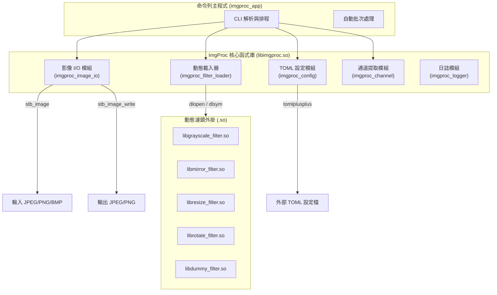

# ImgProc 圖像處理框架 (C/C++ Dynamic Plugin Framework)


**ImgProc** 是一個以 C/C++ 開發的高效能圖像處理 SDK 與命令列工具 (CLI)。本專案採用動態鏈結庫 (.so) 實作外掛插件架構，允許開發者在執行期間動態載入各種影像濾鏡。除了支援單一濾鏡處理，也支援多濾鏡串接 (Filter Chaining)、TOML 設定檔參數讀取、自動批次處理以及單一色彩通道提取功能。

---

## ✨ 核心特色 (Features)

- 🔌 **動態外掛系統 (Dynamic Plugin Architecture)**: 濾鏡模組透過 C-ABI 導出介面，在執行期使用 `dlopen/dlsym` 載入，主程式與濾鏡高度解耦。
- 🔗 **濾鏡串接 (Filter Chaining)**: 支援在命令列依序指定多個濾鏡與對應的設定檔，無縫建立影像處理管線。
- ⚙️ **TOML 設定解析**: 內建 `tomlplusplus` 整合，讓動態濾鏡可輕鬆讀取外部的數值與字串設定。
- 🖼️ **主流格式支援**: 基於 `stb_image` 實作，支援 JPEG、PNG 與 BMP 檔案解碼，以及 JPEG 與 PNG 檔案編碼輸出。
- 🛡️ **安全的記憶體管理**: 使用自訂的資源釋放回呼函式 (`release_fn`)，確保各動態濾鏡在轉譯過程中的記憶體分配能夠被正確回收，防止記憶體洩漏。
- 🚀 **自動批次處理 (Auto Batch Mode)**: 在不指定參數的情況下，CLI 將自動掃描 `inputs/` 目錄並將處理後的結果輸出至 `outputs/`。

---

## 🏗️ 系統架構 (Architecture)



---

## 📂 專案目錄結構 (Directory Structure)

```text
├── CMakeLists.txt              # CMake 建置腳本
├── README.md                   # 本說明文件
├── main.cpp                    # CLI 主程式
├── include/                    # SDK 公開 C API 標頭檔
│   ├── imgproc_*.h             # 核心模組介面 (Loader, Config, IO, Logger, Channel)
│   └── stb_image*.h            # 第三方影像編解碼庫
├── src/                        # 核心庫與濾鏡外掛實作 (C/C++)
│   ├── priv/                   # 內部私有標頭檔 (imgproc_helper.h)
│   ├── dummy_filter.cpp        # 測試用空濾鏡
│   ├── grayscale_filter.cpp    # 灰階濾鏡
│   ├── mirror_filter.cpp       # 鏡像濾鏡
│   ├── resize_filter.cpp       # 縮放濾鏡
│   ├── rotate_filter.cpp       # 旋轉濾鏡
│   └── imgproc_*.cpp           # 核心功能實作
├── tests/                      # 單元與整合測試套件 (CTest)
├── inputs/                     # 批次處理輸入目錄
└── outputs/                    # 批次處理輸出目錄
```

---

## 🛠️ 編譯與建置 (Build & Install)

### 系統需求
- **CMake**: 版本 >= 3.20
- **編譯器**: 支援 C99 與 C++17 (如 GCC, Clang, 或 MSVC)

### 建置步驟
```bash
# 1. 建立並進入 build 目錄
mkdir build && cd build

# 2. 產生建置組態
cmake ..

# 3. 進行編譯 (支援多執行緒)
make -j$(nproc)
```

### 執行測試
```bash
# 在 build 目錄中執行所有 CTest 單元測試
ctest --output-on-failure
```

---

## 💻 命令列操作指南 (CLI Usage)

編譯完成後，執行檔將位於 `build/imgproc_app`。

### 語法說明
```text
Usage: ./imgproc_app [options]
Options:
  -i, --input <file>     輸入影像路徑 (JPG/PNG/BMP)
  -o, --output <file>    輸出影像路徑 (JPG/PNG)
  -f, --filter <so_path> 濾鏡動態庫路徑 (.so)，可多次指定以進行串接
  -c, --config <toml>    TOML 設定檔路徑，須與 -f 的順序相對應
  -ch, --channel <R|G|B> 提取特定色彩通道 (R, G, 或 B)
  -h, --help             顯示說明訊息
```

### 常見範例

**1. 單一濾鏡處理 (灰階)**
```bash
./build/imgproc_app -i inputs/sample.jpg -o outputs/gray.png -f ./build/libgrayscale_filter.so
```

**2. 濾鏡串接 (縮放 -> 旋轉 -> 鏡像)**
```bash
./build/imgproc_app \
  -i inputs/sample.png \
  -o outputs/result.png \
  -f ./build/libresize_filter.so -c tests/test_resize_config.toml \
  -f ./build/librotate_filter.so -c tests/rotate_filter_config.toml \
  -f ./build/libmirror_filter.so -c tests/mirror_filter_config.toml
```

**3. 提取色彩通道 (保留紅色通道)**
```bash
./build/imgproc_app -i inputs/sample.jpg -o outputs/red.png -ch R
```

**4. 自動批次模式**
若不加上任何參數，程式將自動讀取 `inputs/` 目錄中的所有圖片，處理後存入 `outputs/` 目錄。
```bash
./build/imgproc_app
```

---

## 🧩 開發自訂濾鏡外掛 (Plugin Development)

您可以輕鬆擴充新的濾鏡。自訂濾鏡需實作 `ImgProcFilterApi` 介面，並匯出三個 C-ABI 函式：`create`, `destroy`, `transform`。

**範例實作框架：**
```cpp
#include <imgproc_filter_common.h>
#include <cstdlib>
#include <cstring>

// 1. 建立濾鏡與讀取設定
extern "C" ImgProcStatus my_filter_create(ImgProcFilterHandle* handle, ImgProcConfigHandle config) {
    // 初始化資源，使用 config 讀取 TOML 參數...
    *handle = reinterpret_cast<ImgProcFilterHandle>(new int(1)); // 範例
    return IMGPROC_SUCCESS;
}

// 2. 釋放濾鏡資源
extern "C" ImgProcStatus my_filter_destroy(ImgProcFilterHandle handle) {
    if (handle) delete reinterpret_cast<int*>(handle);
    return IMGPROC_SUCCESS;
}

// 3. 執行影像轉換
extern "C" ImgProcStatus my_filter_transform(ImgProcFilterHandle handle, ImgProcImage* input, ImgProcImage** output) {
    if (!handle || !input || !output) return IMGPROC_ERROR_INVALID_ARG;
    
    // 配置新影像與記憶體
    ImgProcImage* out = new ImgProcImage();
    *out = *input; // 複製 metadata
    out->data = std::malloc(input->data_size);
    out->release_fn = [](ImgProcImage* img) {
        if (img && img->data) { std::free(img->data); img->data = nullptr; }
    };
    
    // 實作像素處理邏輯...
    std::memcpy(out->data, input->data, input->data_size);
    
    // 釋放傳入之輸入影像資料記憶體（依據 ImgProcFilterTransformFn 規範）
    if (input->release_fn) {
        input->release_fn(input);
    }
    
    *output = out;
    return IMGPROC_SUCCESS;
}

// 4. 註冊導出函式
IMGPROC_FILTER_DECLARE_CREATE_FN(my_filter_create)
IMGPROC_FILTER_DECLARE_DESTROY_FN(my_filter_destroy)
IMGPROC_FILTER_DECLARE_TRANSFORM_FN(my_filter_transform)
```
編譯為 shared library (`.so`) 後，即可使用 `-f` 參數掛載執行！
