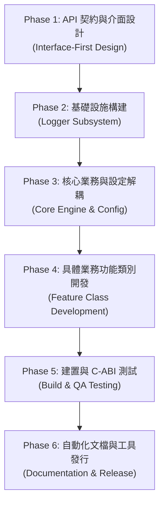

# 🏗️ 企業級 C/C++ 專案架構、開發流程與 AI 代理人開發規範手冊
> **Enterprise C/C++ System Architecture, SDLC & AI Agent Coding Guidelines**
> 
> *註：本手冊為通用型企業級 C/C++ 專案架構與開發規範。當本檔案放置於任何專案根目錄或專案 context 中時，AI 代理人 (AI Coding Agent) 必須嚴格遵守以下所有通用架構規範與代碼安全準則。*

---

## ⚠️ 0. 專案編譯模式指示 (Static / Dynamic Mode Instructions)

> [!IMPORTANT]
> **【AI 代理人特別指示】：**
> * **靜態編譯模式 (Static Link Mode)：** 若專案標註為靜態編譯模式（以便於單一執行檔之發行與分發），AI 代理人在產生新功能時切勿生成獨立的 `.so` / `.dll` 動態庫檔案，應將新功能寫成獨立的 `.cpp` 類別並靜態編譯連結至主執行檔中。
> * **動態外掛模式 (Dynamic Plugin Mode)：** 若專案標註為動態外掛模式，AI 代理人應將功能獨立編譯為動態庫，並透過 POSIX `dlopen` / Windows `LoadLibrary` 機制動態載入。

---

## 🛠️ 0.1 工程禁忌與語法分工約定 (Coding Anti-Patterns & Conventions)

### 企業級 C++ 禁忌規條：嚴禁 `using namespace std;`
* **禁用原因：** 企業級 C++ 專案**嚴禁在標頭檔與 `.cpp` 中寫 `using namespace std;`**！
* **危害：** `std` 命名空間包含數以千計的通用符號（如 `count`, `size`, `map`, `min`, `max`），全局引入會造成嚴重的命名空間污染 (Pollution) 與難以追查的符號名稱衝突。
* **規範：** 強制要求明確撰寫 `std::` 前綴（如 `std::string`, `std::unique_ptr`），不僅能避免衝突，還能提升程式碼出處的明確性與可讀性。

### `struct` 與 `class` 的分工約定
* **語法唯一差異：** 預設存取權限不同（`struct` 預設為 `public`；`class` 預設為 `private`）。
* **工程習慣分工：**
  * **使用 `struct`：** 純粹打包一堆公開資料變數（POD / DTO），且需要與 C 語言 ABI 相容時使用。
  * **使用 `class`：** 進行物件導向封裝、含有私有成員變數 (`private`) 與複雜業務邏輯函數時使用。

---

## 🏛️ 1. 系統四層分層架構 (4-Layer System Architecture)

本架構採用高內聚、低耦合的通用四層分層設計，適用於任何 C/C++ 領域專案（如 AI 引擎、圖像處理、音訊流、網路服務、資料庫核心）。

```
┌─────────────────────────────────────────────────────────────┐
│ Layer 1: 應用與測試層 (Application & Client Layer)           │
│   • 主程式 (src/main.cpp) / 單元測試 (tests/*.c) / Python 上層 │
└──────────────────────────────┬──────────────────────────────┘
                               │ (純 C-ABI 呼叫 / 介面類別實例化)
┌──────────────────────────────▼──────────────────────────────┐
│ Layer 2: 對外 API 與介面層 (Public SDK & Interface Layer)   │
│   • include/*.h                                             │
│   • 職責：提供控制句柄 (Handle)、狀態碼 (Status)、抽象介面宣告    │
└──────────────────────────────┬──────────────────────────────┘
                               │ (內部 C++ 強型態轉型與實作)
┌──────────────────────────────▼──────────────────────────────┐
│ Layer 3: 核心業務邏輯與引擎層 (Core Engine Layer)            │
│   • 外部設定檔解析模組 (Config Parser)                       │
│   • 全域並行日誌基礎設施模組 (MT-Safe Logger Subsystem)      │
│   • 資源 / 檔讀寫與系統工具模組 (I/O & Utilities Engine)     │
└──────────────────────────────┬──────────────────────────────┘
                               │ (編譯連結 / 動態載入)
┌──────────────────────────────▼──────────────────────────────┐
│ Layer 4: 具體業務功能模組層 (Business & Feature Modules)    │
│   • 繼承抽象介面之各項具體業務邏輯類別檔 (.cpp)              │
│   • 職責：純粹實現具體演算法或業務邏輯                       │
└─────────────────────────────────────────────────────────────┘
```

---

## 🔄 2. 標準專案開發 6 大階段流程 (Software Development Lifecycle)

在開發或擴充任何 C/C++ 模組時，必須嚴格遵循以下 **`.h` -> `.cpp` -> `tests`** 的迭代順序進行：



1. **Phase 1：API 契約與介面設計 (Interface-First Design)**
   * 先定義 `include/*.h` 標頭檔與抽象基類介面，嚴禁先編寫 `.cpp` 實作。
   * 確立對外 `Status` 狀態碼、`Handle` 不透明控制句柄。
2. **Phase 2：基礎設施構建 (Logger Subsystem)**
   * 優先開發全域 `Logger` 模組，提供多執行緒安全 (`MT-safe`) 的格式化日誌通道。
3. **Phase 3：核心業務與設定解耦 (Core Engine & Config)**
   * 開發 `Config` 設定檔解析器，將軟體運行參數抽離至外部設定檔（如 `.toml` / `.json`）。
4. **Phase 4：具體業務功能類別開發 (Feature Class Development)**
   * 撰寫獨立的功能類別（繼承抽象介面），實現具體業務與演算法邏輯。
5. **Phase 5：自動化建置與 C-ABI 測試 (Build & QA Testing)**
   * 配置 CMake 腳本進行標頭檔隔離，**使用純 C 語言撰寫測試檔 (`tests/*.c`)** 驗證 SDK 可相容性。
6. **Phase 6：自動化文檔與工具發行 (Documentation & Release)**
   * 配置 Doxygen 自動生成 HTML API 手冊（標註 `@note MT-safe`），進行發行打包。

---

## 🚨 3. AI 代理人寫程式必須遵循的開發注意事項與安全規範 (AI Coding Guidelines)

**當 AI 代理人 (AI Coding Agent) 生成、重構或修改本專案程式碼時，必須嚴格遵守以下準則：**

### 🛡️ 3.1 C-ABI 與介面邊界規範
* **`extern "C"` 雙向包裹：** 純 C 語言介面標頭檔必須使用 `#ifdef __cplusplus extern "C" { #endif` 包裹，防止 C++ Name Mangling。
* **Opaque Handle 封裝：** 對外控制句柄一律宣告為不透明指標（如 `typedef void* ModuleHandle;`），嚴禁在 `.h` 中洩漏內部結構體與第三方庫定義。
* **句柄比對規範：** 檢查句柄是否有效時，必須使用具體定義的無效巨集常數，嚴禁硬寫 `== NULL`！
* **絕對禁止 Exception 跨界：** 介面層嚴禁拋出 C++ Exception。內部必須關閉 Exception 或傳回錯誤碼，對外一律傳回枚舉狀態碼 `Status`。
* **函數與函數指標宣告語法（括號規範）：**
  * **1 個括號：** 宣告實體函數（如 `const char* get_status_str(...)`）。
  * **2 個括號 `(*Type)()`：** 宣告函數指標型態。第一個括號 `(*Name)` 聲明其為指標；第二個括號 `()` 宣告參數列表。
* **指標參數原則：**
  * 創建立/帶回新物件記憶體：使用雙重指標 `Type**`。
  * 唯讀存取或就地銷毀：使用單一指標 `Type*`。
  * 字串與輸入陣列參數：強制標註 `const char*` 或 `const Type*`。

### 🔐 3.2 記憶體安全與 RAII 規範
* **嚴禁裸指標管理 Heap 資源：** 內部實作必須使用 `std::unique_ptr<T>` 管理資源（若包含自訂銷毀函數需綁定 Custom Deleter）。
* **懸空指標防禦清零：** 物件銷毀或資源釋放後，**必須將內部所有指標欄位顯式歸零為 `nullptr`**，杜絕懸空指標 (Dangling Pointer) 與 Use-After-Free 漏洞。
* **零拷貝搬移：** 大型物件所有權轉移時，強制使用 `std::move` 避免複製開銷。

### ⚡ 3.3 數值安全與轉型規範
* **數值溢位防禦：** 跨型態轉型（如 `int64_t` 轉 `int32_t`）必須使用 `std::numeric_limits<T>::max()` 進行上界檢查。若超界必須記錄 `WARN` 日誌並退回預設值。
* **顯式強型態轉換：** 嚴禁使用 C 風格舊式轉型 `(Type)val`。必須明確寫出 `static_cast` 或 `reinterpret_cast`。

### 🧵 3.4 多執行緒安全與 Doxygen 註解規範 (Doxygen Tag Standards)
* **無鎖原子保護：** 凡會被多個執行緒同時讀寫的全域/靜態變數（如 Log 過濾等級），必須使用 C++11 `std::atomic<T>` 或 `std::mutex` 保護。
* **Doxygen `@` 標籤註解標準：** 所有標頭檔對外 API 必須包含高標準 Doxygen 註解（包含 `@file`, `@brief`, `@param [in/out]`, `@retval`, `@return`, `@note MT-safe`, `@warning`）。

---

## 📦 4. 發行與交付清單 (Release Checklist)

當專案開發完成準備發行時，最終交付包應包含以下內容：

| 交付項目 | 檔案類型 | 說明 |
| :--- | :--- | :--- |
| **發行產物** | 可執行檔 / 共享庫 (`.so` / `.dll`) | 依專案模式編譯出之二進位軟體或 SDK 庫 |
| **對外標頭檔** | `include/*.h` | C 語言 / C++ 介面說明書，供客戶引用的頭檔案 |
| **外部設定檔** | `config.toml` / `.json` | 解耦的系統運行參數控制面板 |
| **API 文件手冊** | `html/index.html` | Doxygen 自動產生的系統與 API 規格手冊 |

---
*本手冊為通用型企業級規範，適用於任何未來 C/C++ 專案之架構規劃與 AI Coding Agent 指引。*
